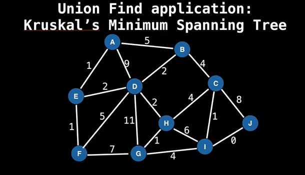
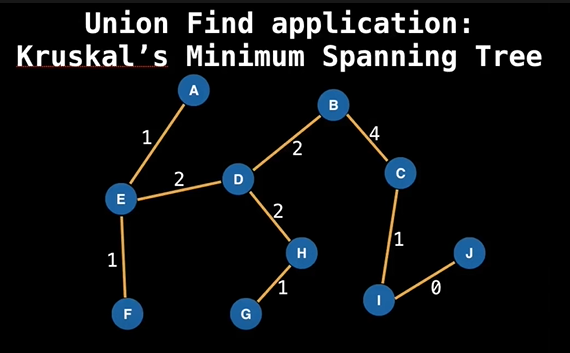

**Table of contents**

- [DataStructure-Codecamp](#datastructure-codecamp)
- [What is Data Structure?](#what-is-data-structure)
- [Why Data Strucutres?](#why-data-strucutres)
- [Abstract Data Types vs Data Structures](#abstract-data-types-vs-data-structures)
  - [Abstract Data Type](#abstract-data-type)
  - [Examples](#examples)
- [Introduction to Big-O](#introduction-to-big-o)
  - [Big-O Notation](#big-o-notation)
  - [Big-O properties](#big-o-properties)
  - [Big-O example](#big-o-example)
- [Static and Dynamic Arrays](#static-and-dynamic-arrays)
  - [What is a static array?](#what-is-a-static-array)
  - [When and where is a static array used?](#when-and-where-is-a-static-array-used)
  - [Complexity](#complexity)
  - [Dynamic Array](#dynamic-array)
  - [How can we implement a dynamic array?](#how-can-we-implement-a-dynamic-array)
  - [Dynamic Array Source Code](#dynamic-array-source-code)
- [Singly and Doubly Linked List](#singly-and-doubly-linked-list)
  - [What is a linked list?](#what-is-a-linked-list)
  - [Where are linked lists used?](#where-are-linked-lists-used)
  - [Terminology](#terminology)
  - [Singly vs Doubly Linked Lists](#singly-vs-doubly-linked-lists)
  - [Singly and Doubly linked list Pros and Cons](#singly-and-doubly-linked-list-pros-and-cons)
  - [Complexity Analysis](#complexity-analysis)
  - [Doubly Linked List Source Code](#doubly-linked-list-source-code)
- [Stack](#stack)
  - [When and where a Stack is used?](#when-and-where-a-stack-is-used)
  - [Complexity Analysis](#complexity-analysis-1)
  - [Stack Source Code](#stack-source-code)
- [Queues](#queues)
  - [What is a Queue?](#what-is-a-queue)
  - [When and where is a Queue used?](#when-and-where-is-a-queue-used)
  - [Complexity Analysis](#complexity-analysis-2)
  - [Queue Example](#queue-example)
  - [Queue Implementation](#queue-implementation)
  - [Queue Source Code](#queue-source-code)
- [Priority Queues with an Interlude on Heaps](#priority-queues-with-an-interlude-on-heaps)
  - [What is a Priority Queue?](#what-is-a-priority-queue)
  - [What is a Heap?](#what-is-a-heap)
  - [When and where is a PQ used?](#when-and-where-is-a-pq-used)
  - [Complexity PQ with binary heap](#complexity-pq-with-binary-heap)
  - [Ways of Implementing a Priority Queue](#ways-of-implementing-a-priority-queue)
  - [Priority Queue with Binary Heap](#priority-queue-with-binary-heap)
  - [Priority Queue Source Code](#priority-queue-source-code)
- [Union Find (Disjoint Set)](#union-find-disjoint-set)
  - [What is Union Find?](#what-is-union-find)
  - [When and where is a Union Find used?](#when-and-where-is-a-union-find-used)
  - [Complexity of Union Find](#complexity-of-union-find)
  - [Union Find application: Kruskal's Minimum Spanning tree](#union-find-application-kruskals-minimum-spanning-tree)
    - [How does it work?](#how-does-it-work)
  - [Union Find - Union and Find Operations](#union-find---union-and-find-operations)
    - [Find Operations](#find-operations)
    - [Union Operations](#union-operations)
  - [Union Find Source Code](#union-find-source-code)
- [Binary Trees and Binary Search Tree (BST)](#binary-trees-and-binary-search-tree-bst)
  - [What is Tree?](#what-is-tree)
  - [What is a binary tree?](#what-is-a-binary-tree)
  - [What is a Binary Search Tree (BST)?](#what-is-a-binary-search-tree-bst)
  - [When and where are BT used?](#when-and-where-are-bt-used)
  - [Complexity of BSTs](#complexity-of-bsts)
  - [Implementation of BST](#implementation-of-bst)
    - [Adding elements to a BST](#adding-elements-to-a-bst)
    - [Removing elements from a BST](#removing-elements-from-a-bst)
      - [Remove Phase](#remove-phase)
- [New keywords/ term that I didn't know before](#new-keywords-term-that-i-didnt-know-before)
  - [Amortized time complexity](#amortized-time-complexity)
  - [Lookup table](#lookup-table)
  - [Treap](#treap)
  - [AVL Trees](#avl-trees)

## DataStructure-Codecamp

This repository is all about **Data Strucutres** from the [YouTube video](https://www.youtube.com/watch?v=RBSGKlAvoiM&feature=youtu.be) of _freecodeCamp.org_, mentored by **William Fiset**.

## What is Data Structure?

A data strucutre is a way of organizing data so that it can be used effective ly. It is a way of organizing data in some fashions that later on it can be accessed, quered and perhaps even updated quickly and easily.

## Why Data Strucutres?

- They are essential ingredients in creating fast and powerful algorithms.
- They help to manage and organize data.
- They make code cleaner and easier to understand.
  _Difference between bad, medium and excellent programmers is that one who understands how and when to use appropriate data structures they are trying to finish_.

## Abstract Data Types vs Data Structures

### Abstract Data Type

An abstract data type (ADT) is an abstraction of a data strucutre which provides only the interface to which a data structure must adhere to. The interface does not give any specific details how something should be implemented or in what programming language.

### Examples

| Abstraction (ADT) | Implementation (DS)                                           |
| ----------------- | ------------------------------------------------------------- |
| List              | Dynamic Array, Linked List                                    |
| Queue             | Linked List based Queue, Array based Queue, Stack based Queue |
| Map               | Tree Map, Hash Map / Hash Table                               |
| Vehicle           | Golf Cart, Bicycle, smart cart                                |

## Introduction to Big-O

### Big-O Notation

n - the size of the input complexities ordered in from smalles to largest

| Complexity name   | Notation   |
| ----------------- | ---------- |
| Constant Time     | O(1)       |
| Logarithmic Time  | O(log(n))  |
| Linear Time       | O(n)       |
| Linearithmic Time | O(nlog(n)) |
| Quadric Time      | O(n^2)     |
| Cubic Time        | O(n^3)     |
| Exponential Time  | O(b^2)     |
| Factorial Time    | O(n!)      |

_N.B: In exponential time **b** represents numbers that should be greater than 1 (b>1) like 2, 3, 4 etc_

### Big-O properties

O(n + c) = O(n)
O(cn) = O(n), c > 0 [*c represents the constent*]

f(n) = 7log(n)^3 + 15n^2 + 2n^3 + 8
O(f(n)) = O(n^3)

### Big-O example

- Finding all subsets of a set - **O(2^n)**
- Finding all permutation of a string - **O(n!)**
- Sorting using merge sort - **O(nlog(n))**
- Iterating over all the cells in a matrix of size n by m - O(nm)

  [For More](https://github.com/zubayerhimel/coding-Interview/blob/master/BigO/BigO.md)

## Static and Dynamic Arrays

### What is a static array?

A static array is a fixed length container containing n elelments indexable from the range [0, n-1]

Q: **What is meant by being 'indexable'?** <br>
This means that each slot/ index in the array can be referenced with a number.
Static array is a contiguous chunk of memories.

### When and where is a static array used?

- Storing and accessing sequential data
- Temporarily storing objects.
- Used by IO routines as buffers
- Lookup tables and inverse lookup tables
- Can be used to return multiple values from a function
- Used in dynamic programming to cache answers to sub problems.

### Complexity

| Type of work | Static array | Dynamic array |
| ------------ | ------------ | ------------- |
| Access       | O(1)         | O(1)          |
| Search       | O(n)         | O(n)          |
| Insertion    | N/A          | O(n)          |
| Appending    | N/A          | O(1)          |
| Deletion     | N/A          | O(n)          |

### Dynamic Array

The dynamic array can grow and shrink in size.

```
A = [34, 4]
// A.add(-7)
A = [34, 4, -7]
//A.add(34)
A = [34, 4, -7, 34]
//A.remove(4)
A = [34, -7, 34]
```

### How can we implement a dynamic array?

One way is to use a static array!

- Create a static array with an initial capacity
- Add elements to the underlying static array, keeping track of the number of elements.
- If adding another element exceeds the capacity, then create a new static array with twice the capacity and copy the original elements into it.

### Dynamic Array Source Code

<details>
<summary>Code </summary>

```java
/**
 * A generic dynamic array implementation
 *
 * @author William Fiset, william.alexandre.fiset@gmail.com
 */
package com.williamfiset.datastructures.dynamicarray;

@SuppressWarnings("unchecked") // ignore all the generic warnings that java has
public class DynamicArray<T> implements Iterable<T> {

  private T[] arr;
  private int len = 0; // length user thinks array is
  private int capacity = 0; // Actual array size

  public DynamicArray() {
    this(16);
  }

  public DynamicArray(int capacity) {
    if (capacity < 0) throw new IllegalArgumentException("Illegal Capacity: " + capacity);
    this.capacity = capacity;
    arr = (T[]) new Object[capacity];
  }

  public int size() {
    return len;
  }

  public boolean isEmpty() {
    return size() == 0;
  }

  public T get(int index) {
    return arr[index];
  }

  public void set(int index, T elem) {
    arr[index] = elem;
  }

  public void clear() {
    for (int i = 0; i < len; i++) arr[i] = null;
    len = 0;
  }

  public void add(T elem) {

    // Time to resize!
    if (len + 1 >= capacity) {
      if (capacity == 0) capacity = 1;
      else capacity *= 2; // double the size
      T[] new_arr = (T[]) new Object[capacity];
      for (int i = 0; i < len; i++) new_arr[i] = arr[i];
      arr = new_arr; // arr has extra nulls padded
    }

    arr[len++] = elem;
  }

  // Removes an element at the specified index in this array.
  public T removeAt(int rm_index) {
    if (rm_index >= len || rm_index < 0) throw new IndexOutOfBoundsException();
    T data = arr[rm_index];
    T[] new_arr = (T[]) new Object[len - 1];
    for (int i = 0, j = 0; i < len; i++, j++)
      if (i == rm_index) j--; // Skip over rm_index by fixing j temporarily
      else new_arr[j] = arr[i];
    arr = new_arr;
    capacity = --len;
    return data;
  }

  public boolean remove(Object obj) {
    int index = indexOf(obj);
    if (index == -1) return false;
    removeAt(index);
    return true;
  }

  public int indexOf(Object obj) {
    for (int i = 0; i < len; i++) {
      if (obj == null) {
        if (arr[i] == null) return i;
      } else {
        if (obj.equals(arr[i])) return i;
      }
    }
    return -1;
  }

  public boolean contains(Object obj) {
    return indexOf(obj) != -1;
  }

  // Iterator is still fast but not as fast as iterative for loop
  @Override
  public java.util.Iterator<T> iterator() {
    return new java.util.Iterator<T>() {
      int index = 0;

      @Override
      public boolean hasNext() {
        return index < len;
      }

      @Override
      public T next() {
        return arr[index++];
      }

      @Override
      public void remove() {
        throw new UnsupportedOperationException();
      }
    };
  }

  @Override
  public String toString() {
    if (len == 0) return "[]";
    else {
      StringBuilder sb = new StringBuilder(len).append("[");
      for (int i = 0; i < len - 1; i++) sb.append(arr[i] + ", ");
      return sb.append(arr[len - 1] + "]").toString();
    }
  }
}
```

</details>

## Singly and Doubly Linked List

### What is a linked list?

A linked list is a sequential list of nodes that hold data which point to other nodes also containing data.

### Where are linked lists used?

- Used in many List, Queue & Stack implementations.
- Great for creating circular lists.
- Can easily model real world objects such as trains.
- Used in separate chaining, which is present certain Hashtable impementations to deal with hashing collisions.
- Often used in the implementation of adjacency lists for graphs.

### Terminology

**Head:** The first node in a linked list

**Tail:** The last node in a linked list

**Pointer:** Reference to another node

**Node:** An object containing data and pointer(s)

`3(head) --> 34 --> 12 -->(pointer) --> 90 --> 29(node) --> 44 --> 20(tail)`

### Singly vs Doubly Linked Lists

**Singly linked list** only hold a reference to the next node. In the implementation you always maintain a reference to the head to the linked list and a reference to the tail node for quick additions/removals.

`4-->3-->6-->1-->10-->12`

**Doubly linked list** each node holds a reference to the next and previous node. In the implementation you always maintian a reference to the head and the tail of the doubly linked list to do quick additions/ removal from both ends of your list.

`4<-->3<-->6<-->1<-->10<-->12`

### Singly and Doubly linked list Pros and Cons

| Linked list        | Pros                                    | Cons                                   |
| ------------------ | --------------------------------------- | -------------------------------------- |
| Singly linked list | uses less memory, simpler impementation | cannot easily access previous elements |
| Doubly linked list | can be traversed backwards              | takes 2x memory                        |

### Complexity Analysis

| Task               | Singly linked list | Doubly linked list |
| ------------------ | ------------------ | ------------------ |
| Search             | O(n)               | O(n)               |
| Insertion at head  | O(1)               | O(1)               |
| Insertion at tail  | O(1)               | O(1)               |
| Remove from head   | O(1)               | O(1)               |
| Remove from tail   | O(n)               | O(1)               |
| Remove from middle | O(n)               | O(n)               |

_N.B. For search operation we get linear complexity for both linked list. Its because for the worst case scenario we have to traverse through all the elements of the list to find the exact element. Remove from tail in singly linked list takes linear time as we don't know what is the new tail of the updated linked list. So we need to traverse whole list to find the new tail. Remove from middle also takes linear time for both linked list because for the worst case scenario we may have to traverse all the elements to get the exact element to remove_

### Doubly Linked List Source Code

<details>
<summary>Code</summary>

```java

/**
 * A doubly linked list implementation.
 *
 * @author William Fiset, william.alexandre.fiset@gmail.com
 */
package com.williamfiset.datastructures.linkedlist;

public class DoublyLinkedList<T> implements Iterable<T> {
  private int size = 0;
  private Node<T> head = null;
  private Node<T> tail = null;

  // Internal node class to represent data
  private static class Node<T> {
    private T data;
    private Node<T> prev, next;

    public Node(T data, Node<T> prev, Node<T> next) {
      this.data = data;
      this.prev = prev;
      this.next = next;
    }

    @Override
    public String toString() {
      return data.toString();
    }
  }

  // Empty this linked list, O(n)
  public void clear() {
    Node<T> trav = head;
    while (trav != null) {
      Node<T> next = trav.next;
      trav.prev = trav.next = null;
      trav.data = null;
      trav = next;
    }
    head = tail = trav = null;
    size = 0;
  }

  // Return the size of this linked list
  public int size() {
    return size;
  }

  // Is this linked list empty?
  public boolean isEmpty() {
    return size() == 0;
  }

  // Add an element to the tail of the linked list, O(1)
  public void add(T elem) {
    addLast(elem);
  }

  // Add a node to the tail of the linked list, O(1)
  public void addLast(T elem) {
    if (isEmpty()) {
      head = tail = new Node<T>(elem, null, null);
    } else {
      tail.next = new Node<T>(elem, tail, null);
      tail = tail.next;
    }
    size++;
  }

  // Add an element to the beginning of this linked list, O(1)
  public void addFirst(T elem) {
    if (isEmpty()) {
      head = tail = new Node<T>(elem, null, null);
    } else {
      head.prev = new Node<T>(elem, null, head);
      head = head.prev;
    }
    size++;
  }

  // Check the value of the first node if it exists, O(1)
  public T peekFirst() {
    if (isEmpty()) throw new RuntimeException("Empty list");
    return head.data;
  }

  // Check the value of the last node if it exists, O(1)
  public T peekLast() {
    if (isEmpty()) throw new RuntimeException("Empty list");
    return tail.data;
  }

  // Remove the first value at the head of the linked list, O(1)
  public T removeFirst() {
    // Can't remove data from an empty list
    if (isEmpty()) throw new RuntimeException("Empty list");

    // Extract the data at the head and move
    // the head pointer forwards one node
    T data = head.data;
    head = head.next;
    --size;

    // If the list is empty set the tail to null
    if (isEmpty()) tail = null;

    // Do a memory cleanup of the previous node
    else head.prev = null;

    // Return the data that was at the first node we just removed
    return data;
  }

  // Remove the last value at the tail of the linked list, O(1)
  public T removeLast() {
    // Can't remove data from an empty list
    if (isEmpty()) throw new RuntimeException("Empty list");

    // Extract the data at the tail and move
    // the tail pointer backwards one node
    T data = tail.data;
    tail = tail.prev;
    --size;

    // If the list is now empty set the head to null
    if (isEmpty()) head = null;

    // Do a memory clean of the node that was just removed
    else tail.next = null;

    // Return the data that was in the last node we just removed
    return data;
  }

  // Remove an arbitrary node from the linked list, O(1)
  private T remove(Node<T> node) {
    // If the node to remove is somewhere either at the
    // head or the tail handle those independently
    if (node.prev == null) return removeFirst();
    if (node.next == null) return removeLast();

    // Make the pointers of adjacent nodes skip over 'node'
    node.next.prev = node.prev;
    node.prev.next = node.next;

    // Temporarily store the data we want to return
    T data = node.data;

    // Memory cleanup
    node.data = null;
    node = node.prev = node.next = null;

    --size;

    // Return the data in the node we just removed
    return data;
  }

  // Remove a node at a particular index, O(n)
  public T removeAt(int index) {
    // Make sure the index provided is valid
    if (index < 0 || index >= size) {
      throw new IllegalArgumentException();
    }

    int i;
    Node<T> trav;

    // Search from the front of the list
    if (index < size / 2) {
      for (i = 0, trav = head; i != index; i++) {
        trav = trav.next;
      }
      // Search from the back of the list
    } else
      for (i = size - 1, trav = tail; i != index; i--) {
        trav = trav.prev;
      }

    return remove(trav);
  }

  // Remove a particular value in the linked list, O(n)
  public boolean remove(Object obj) {
    Node<T> trav = head;

    // Support searching for null
    if (obj == null) {
      for (trav = head; trav != null; trav = trav.next) {
        if (trav.data == null) {
          remove(trav);
          return true;
        }
      }
      // Search for non null object
    } else {
      for (trav = head; trav != null; trav = trav.next) {
        if (obj.equals(trav.data)) {
          remove(trav);
          return true;
        }
      }
    }
    return false;
  }

  // Find the index of a particular value in the linked list, O(n)
  public int indexOf(Object obj) {
    int index = 0;
    Node<T> trav = head;

    // Support searching for null
    if (obj == null) {
      for (; trav != null; trav = trav.next, index++) {
        if (trav.data == null) {
          return index;
        }
      }
      // Search for non null object
    } else
      for (; trav != null; trav = trav.next, index++) {
        if (obj.equals(trav.data)) {
          return index;
        }
      }

    return -1;
  }

  // Check is a value is contained within the linked list
  public boolean contains(Object obj) {
    return indexOf(obj) != -1;
  }

  @Override
  public java.util.Iterator<T> iterator() {
    return new java.util.Iterator<T>() {
      private Node<T> trav = head;

      @Override
      public boolean hasNext() {
        return trav != null;
      }

      @Override
      public T next() {
        T data = trav.data;
        trav = trav.next;
        return data;
      }

      @Override
      public void remove() {
        throw new UnsupportedOperationException();
      }
    };
  }

  @Override
  public String toString() {
    StringBuilder sb = new StringBuilder();
    sb.append("[ ");
    Node<T> trav = head;
    while (trav != null) {
      sb.append(trav.data + ", ");
      trav = trav.next;
    }
    sb.append(" ]");
    return sb.toString();
  }
}

```

</details>

## Stack

A stack is a one-ended linear data structure which models a real world stack by having two primary operations, namely **push** and **pop**.
_Stack refers **LIFO** which means Last In First Out_

### When and where a Stack is used?

- Used by undo mechanism in text editors.
- Used in compiler syntax checking for matching bracket and braces.
- Can be used to model a pile of books or plates.
- Used behind the scenes to support recursion by keeping track of previous function calls.
- Can be sued to do a Depth First Search (DFS) on a graph.

### Complexity Analysis

| Task      | Complexity |
| --------- | ---------- |
| Pushing   | O(1)       |
| Popping   | O(1)       |
| Peeking   | O(1)       |
| Searching | O(n)       |
| Size      | O(1)       |

_N.B. Searching takes liner time as the element maybe not be found at the top of the stack, so we need to traverse through the whole stack for the element_

### Stack Source Code

<details>
<summary>Code</summary>

```java
/**
 * A linked list implementation of a stack
 *
 * @author William Fiset, william.alexandre.fiset@gmail.com
 */
package com.williamfiset.datastructures.stack;

public class Stack<T> implements Iterable<T> {

  private java.util.LinkedList<T> list = new java.util.LinkedList<T>();

  // Create an empty stack
  public Stack() {}

  // Create a Stack with an initial element
  public Stack(T firstElem) {
    push(firstElem);
  }

  // Return the number of elements in the stack
  public int size() {
    return list.size();
  }

  // Check if the stack is empty
  public boolean isEmpty() {
    return size() == 0;
  }

  // Push an element on the stack
  public void push(T elem) {
    list.addLast(elem);
  }

  // Pop an element off the stack
  // Throws an error is the stack is empty
  public T pop() {
    if (isEmpty()) throw new java.util.EmptyStackException();
    return list.removeLast();
  }

  // Peek the top of the stack without removing an element
  // Throws an exception if the stack is empty
  public T peek() {
    if (isEmpty()) throw new java.util.EmptyStackException();
    return list.peekLast();
  }

  // Allow users to iterate through the stack using an iterator
  @Override
  public java.util.Iterator<T> iterator() {
    return list.iterator();
  }
}

```

</details>

## Queues

### What is a Queue?

A queue is a linear data structure which models real world queues by having two primary operations, namely enqueue and dequeue.
_It referes **FIFO** First In First Out_

### When and where is a Queue used?

- Any waiting line models a queue, for example a lineup at a movie theatre.
- Can be used to efficiently keep track of the x most recently added elements.
- Web server request management where you want first come first serve.
- Bradth First Search (BFS) graph traversal.

### Complexity Analysis

| Task                    | Complexity |
| ----------------------- | ---------- |
| Enqueue/Adding/Offering | O(1)       |
| Dequeue/Polling         | O(1)       |
| Peeking                 | O(1)       |
| Contains                | O(n)       |
| Removal                 | O(n)       |
| Is Empty                | O(1)       |

_N.B. **Peeking** means looking for a value in front of the queue without removing it. It only returns the first value of the queue. If the queue is empty then it returns null. **Contains** means check if the value is in the queue. **Removal** means to remove an element from the queue entirely._

### Queue Example

Example of queue is Breadth First Search. Below is the process of how BFS works with queue -

```
Let Q be a Queue
Q.enqueue(starting_node)
starting_node.visited = true

while Q is not empty Do
  node = Q.dequeue()

  For neighbour in neighbours(node):
    if neighbour has not been visited:
      neighbour.visited = true
      Q.enqueue(neighbour)
```

### Queue Implementation

We can do this by using Array or Linked List (Singly linked list/ Doubly linked list)

Enqueue(5)
Enqueue(1)
Enqueue(6)
Enqueue(17)
Enqueue(8)

**Singly Linked List** Enqueueing

```
(head) Null (tail)

Enqueue(5)

(head)5(tail) --> null

Enqueue(1)

(head)5 --> 1(tail) --> null

Enqueue(6)

(head)5 --> 1 --> 6(tail) --> null

Enqueue(17)

(head)5 --> 1 --> 6 --> 17(tail) --> null

Enqueue(8)

(head)5 --> 1 --> 6 --> 17 --> 8(tail) --> null
```

Dequeueing

```
Dequeue()

null (head)1 --> 6 --> 17 --> 8(tail) --> null

Dequeue()

null (head)6 --> 17 --> 8(tail) --> null

Dequeue()

null (head) 17 --> 8(tail) --> null

Dequeue()

null (head)8(tail) --> null

Dequeue()

(head)(tail) --> null


```

### Queue Source Code

<details>
<summary>Code</summary>

```java

/**
 * A simple queue implementation with a linkedlist
 *
 * @author William Fiset, william.alexandre.fiset@gmail.com
 */
package com.williamfiset.datastructures.queue;

public class Queue<T> implements Iterable<T> {

  private java.util.LinkedList<T> list = new java.util.LinkedList<T>();

  public Queue() {}

  public Queue(T firstElem) {
    offer(firstElem);
  }

  // Return the size of the queue
  public int size() {
    return list.size();
  }

  // Returns whether or not the queue is empty
  public boolean isEmpty() {
    return size() == 0;
  }

  // Peek the element at the front of the queue
  // The method throws an error is the queue is empty
  public T peek() {
    if (isEmpty()) throw new RuntimeException("Queue Empty");
    return list.peekFirst();
  }

  // Poll an element from the front of the queue
  // The method throws an error is the queue is empty
  public T poll() {
    if (isEmpty()) throw new RuntimeException("Queue Empty");
    return list.removeFirst();
  }

  // Add an element to the back of the queue
  public void offer(T elem) {
    list.addLast(elem);
  }

  // Return an iterator to alow the user to traverse
  // through the elements found inside the queue
  @Override
  public java.util.Iterator<T> iterator() {
    return list.iterator();
  }
}

```

</details>

## Priority Queues with an Interlude on Heaps

### What is a Priority Queue?

A priority queue is an Abstract Data Type(ADT) that operates similar to a normal queue except that each element has a certain priority. The priority of the elements in the priority queue determine the order in which elements are removed from the PQ.

_NOTE: Priority queues only supports comparable data, meaning the data inserted into the priority queue must be able to be ordered in some way either from least to greatest or grester to least. This is so that we are able to assign relative priorities to each element._

### What is a Heap?

A heap is a tree based DS that satisfies the heap invariant (also called heap property). If A is a parent node of B then A is ordered with respect to B for all nodes A, B in the heap.

There are two types of heap -

- **Max Heap**
  - Max heap defines when the root or the parent elemenet has the highest or equal value than the child elements.
- **Min Heap**
  - Min heap defines when the root or parent element has the lowest or equal value than the child elements.

_NOTE: **If a heap forms a cycle than it can't be a tree.**_

### When and where is a PQ used?

- Used in certain implementations of Dijkstra's Shortest Path algorithm.
- Anytime you need the dynamically fetch the 'next best' or 'next worst' element.
- Used in Huffman coding (which is often used for lossless data compression).
- Best First Search (BFS) algorithms such as A use PQs to continuously grab the next most porimising node.
- Used by Minimum Spanning Tree (MST) algorithms.

### Complexity PQ with binary heap

| Task                                        | Complexity |
| ------------------------------------------- | ---------- |
| Binary heap construction                    | O(n)       |
| Polling                                     | O(log(n))  |
| Peeking                                     | O(1)       |
| Adding                                      | O(log(n))  |
| Naive removing                              | O(n)       |
| Advance remoing with help from a hash table | O(log(n))  |
| Naive contains                              | O(n)       |
| Contains check with help of a hash table    | O(1)       |

_N.B. Polling and Adding takes logarithmic time. Its because when polling or adding a new node we need to make sure the new element is placed in the right place and meets the condition of heap variant. To meet the condition of heap variant we may need to replace all the elements so it takes logarithmic time._

### Ways of Implementing a Priority Queue

Piority queues are usually implemented with heaps since this give them the best possible time complexity. The Priority Queue is an Abstract Data Type, hence heaps are not the only way to implement PQs. As an example, we could not give us the best possible time complexity.

### Priority Queue with Binary Heap

There are many types of heaps we could use to implement a priority queue like **Binary Heap**, **Fibonacci Heap**, **Binomial Heap**, **Pairing Heap** etc.

**Binary heap**: A binary heap is a binary tree that supports the heap invariant. In a binary tree every node has exactly two children. A **complete binary tree** is a tree in which at every level, except possibly the last is completely filled and all teh nodes are as far left as possible.

**Removing elements from a binary heap**

Polling complexity: _O(log(n))_

Removing: _O(n)_

### Priority Queue Source Code

<details>
<summary>Code</summary>

```java

/**
 * A min priority queue implementation using a binary heap. This implementation tracks each element
 * inside the binary heap with a hashtable for quick removals.
 *
 * @author William Fiset, william.alexandre.fiset@gmail.com
 */
package com.williamfiset.datastructures.priorityqueue;

import java.util.ArrayList;
import java.util.Collection;
import java.util.HashMap;
import java.util.List;
import java.util.Map;
import java.util.Set;
import java.util.TreeSet;

public class BinaryHeapQuickRemovals<T extends Comparable<T>> {

  // The number of elements currently inside the heap
  private int heapSize = 0;

  // The internal capacity of the heap
  private int heapCapacity = 0;

  // A dynamic list to track the elements inside the heap
  private List<T> heap = null;

  // This map keeps track of the possible indices a particular
  // node value is found in the heap. Having this mapping lets
  // us have O(log(n)) removals and O(1) element containment check
  // at the cost of some additional space and minor overhead
  private Map<T, TreeSet<Integer>> map = new HashMap<>();

  // Construct and initially empty priority queue
  public BinaryHeapQuickRemovals() {
    this(1);
  }

  // Construct a priority queue with an initial capacity
  public BinaryHeapQuickRemovals(int sz) {
    heap = new ArrayList<>(sz);
  }

  // Construct a priority queue using heapify in O(n) time, a great explanation can be found at:
  // http://www.cs.umd.edu/~meesh/351/mount/lectures/lect14-heapsort-analysis-part.pdf
  public BinaryHeapQuickRemovals(T[] elems) {

    heapSize = heapCapacity = elems.length;
    heap = new ArrayList<T>(heapCapacity);

    // Place all element in heap
    for (int i = 0; i < heapSize; i++) {
      mapAdd(elems[i], i);
      heap.add(elems[i]);
    }

    // Heapify process, O(n)
    for (int i = Math.max(0, (heapSize / 2) - 1); i >= 0; i--) sink(i);
  }

  // Priority queue construction, O(nlog(n))
  public BinaryHeapQuickRemovals(Collection<T> elems) {
    this(elems.size());
    for (T elem : elems) add(elem);
  }

  // Returns true/false depending on if the priority queue is empty
  public boolean isEmpty() {
    return heapSize == 0;
  }

  // Clears everything inside the heap, O(n)
  public void clear() {
    for (int i = 0; i < heapCapacity; i++) heap.set(i, null);
    heapSize = 0;
    map.clear();
  }

  // Return the size of the heap
  public int size() {
    return heapSize;
  }

  // Returns the value of the element with the lowest
  // priority in this priority queue. If the priority
  // queue is empty null is returned.
  public T peek() {
    if (isEmpty()) return null;
    return heap.get(0);
  }

  // Removes the root of the heap, O(log(n))
  public T poll() {
    return removeAt(0);
  }

  // Test if an element is in heap, O(1)
  public boolean contains(T elem) {

    // Map lookup to check containment, O(1)
    if (elem == null) return false;
    return map.containsKey(elem);

    // Linear scan to check containment, O(n)
    // for(int i = 0; i < heapSize; i++)
    //   if (heap.get(i).equals(elem))
    //     return true;
    // return false;

  }

  // Adds an element to the priority queue, the
  // element must not be null, O(log(n))
  public void add(T elem) {

    if (elem == null) throw new IllegalArgumentException();

    if (heapSize < heapCapacity) {
      heap.set(heapSize, elem);
    } else {
      heap.add(elem);
      heapCapacity++;
    }

    mapAdd(elem, heapSize);

    swim(heapSize);
    heapSize++;
  }

  // Tests if the value of node i <= node j
  // This method assumes i & j are valid indices, O(1)
  private boolean less(int i, int j) {

    T node1 = heap.get(i);
    T node2 = heap.get(j);
    return node1.compareTo(node2) <= 0;
  }

  // Perform bottom up node swim, O(log(n))
  private void swim(int k) {

    // Grab the index of the next parent node WRT to k
    int parent = (k - 1) / 2;

    // Keep swimming while we have not reached the
    // root and while we're less than our parent.
    while (k > 0 && less(k, parent)) {

      // Exchange k with the parent
      swap(parent, k);
      k = parent;

      // Grab the index of the next parent node WRT to k
      parent = (k - 1) / 2;
    }
  }

  // Top down node sink, O(log(n))
  private void sink(int k) {

    while (true) {

      int left = 2 * k + 1; // Left  node
      int right = 2 * k + 2; // Right node
      int smallest = left; // Assume left is the smallest node of the two children

      // Find which is smaller left or right
      // If right is smaller set smallest to be right
      if (right < heapSize && less(right, left)) smallest = right;

      // Stop if we're outside the bounds of the tree
      // or stop early if we cannot sink k anymore
      if (left >= heapSize || less(k, smallest)) break;

      // Move down the tree following the smallest node
      swap(smallest, k);
      k = smallest;
    }
  }

  // Swap two nodes. Assumes i & j are valid, O(1)
  private void swap(int i, int j) {

    T i_elem = heap.get(i);
    T j_elem = heap.get(j);

    heap.set(i, j_elem);
    heap.set(j, i_elem);

    mapSwap(i_elem, j_elem, i, j);
  }

  // Removes a particular element in the heap, O(log(n))
  public boolean remove(T element) {

    if (element == null) return false;

    // Linear removal via search, O(n)
    // for (int i = 0; i < heapSize; i++) {
    //   if (element.equals(heap.get(i))) {
    //     removeAt(i);
    //     return true;
    //   }
    // }

    // Logarithmic removal with map, O(log(n))
    Integer index = mapGet(element);
    if (index != null) removeAt(index);
    return index != null;
  }

  // Removes a node at particular index, O(log(n))
  private T removeAt(int i) {

    if (isEmpty()) return null;

    heapSize--;
    T removed_data = heap.get(i);
    swap(i, heapSize);

    // Obliterate the value
    heap.set(heapSize, null);
    mapRemove(removed_data, heapSize);

    // Removed last element
    if (i == heapSize) return removed_data;

    T elem = heap.get(i);

    // Try sinking element
    sink(i);

    // If sinking did not work try swimming
    if (heap.get(i).equals(elem)) swim(i);

    return removed_data;
  }

  // Recursively checks if this heap is a min heap
  // This method is just for testing purposes to make
  // sure the heap invariant is still being maintained
  // Called this method with k=0 to start at the root
  public boolean isMinHeap(int k) {

    // If we are outside the bounds of the heap return true
    if (k >= heapSize) return true;

    int left = 2 * k + 1;
    int right = 2 * k + 2;

    // Make sure that the current node k is less than
    // both of its children left, and right if they exist
    // return false otherwise to indicate an invalid heap
    if (left < heapSize && !less(k, left)) return false;
    if (right < heapSize && !less(k, right)) return false;

    // Recurse on both children to make sure they're also valid heaps
    return isMinHeap(left) && isMinHeap(right);
  }

  // Add a node value and its index to the map
  private void mapAdd(T value, int index) {

    TreeSet<Integer> set = map.get(value);

    // New value being inserted in map
    if (set == null) {

      set = new TreeSet<>();
      set.add(index);
      map.put(value, set);

      // Value already exists in map
    } else set.add(index);
  }

  // Removes the index at a given value, O(log(n))
  private void mapRemove(T value, int index) {
    TreeSet<Integer> set = map.get(value);
    set.remove(index); // TreeSets take O(log(n)) removal time
    if (set.size() == 0) map.remove(value);
  }

  // Extract an index position for the given value
  // NOTE: If a value exists multiple times in the heap the highest
  // index is returned (this has arbitrarily been chosen)
  private Integer mapGet(T value) {
    TreeSet<Integer> set = map.get(value);
    if (set != null) return set.last();
    return null;
  }

  // Exchange the index of two nodes internally within the map
  private void mapSwap(T val1, T val2, int val1Index, int val2Index) {

    Set<Integer> set1 = map.get(val1);
    Set<Integer> set2 = map.get(val2);

    set1.remove(val1Index);
    set2.remove(val2Index);

    set1.add(val2Index);
    set2.add(val1Index);
  }

  @Override
  public String toString() {
    return heap.toString();
  }
}
```

</details>

## Union Find (Disjoint Set)

### What is Union Find?

**Union Find** is a data structure that keeps track of elements which are split into one or more disjoint sets. It has two primary operations - **_Find_** and **_Union_**

**Find**, given an element find tells what group that element belongs to.

**Union** merge the group together.

### When and where is a Union Find used?

- Kruskal's minimum spanning tree algorithm
- Grid percolation
- Network connectivity
- Least common ancestor in trees
- Image processing

### Complexity of Union Find

| Task               | Complexity |
| ------------------ | ---------- |
| Construction       | O(n)       |
| Union              | α(n)       |
| Find               | α(n)       |
| Get component size | α(n)       |
| Check if connected | α(n)       |
| Count components   | O(1)       |

_N.B. α(n) means Amortized constant time_

### Union Find application: Kruskal's Minimum Spanning tree

Given a graph G = (V, E) we want to find a minimum spanning tree in the graph (it may not be unique). A minimum spanning tree is a subset of the edges which connect all vertices in the graph with the minimal total edge cost. In short, you have to traverse all the edges of the graph or network graph with the minimum cost.

<p align="center">
     
</p>
<p align="center">
<em> Graph </em>
</p>

<p align="center">
     
</p>
<p align="center">
<em> Minimum Spanning Tree with weight 14</em>
</p>

#### How does it work?

- Sort edges by ascending edge weight.
- Walk through the sorted edges and look at the two nodes the edge belongs to, if the nodes are already unified we don't include this edge, otherwise we include it and unify the nodes.
- The algorithm terminates when every edge has been processed or all the vertices have been unified.

### Union Find - Union and Find Operations

#### Find Operations

To find which component a particular element belongs to find the root of that component by follwoing the parent nodes until a self loop is reached (a node who's parent is itself).

#### Union Operations

To unify two elements find which are the root nodes of each component and if the root nodes are different make one of the root nodes be the parent of the other.

### Union Find Source Code

<details>
<summary>Code</summary>

```java
/**
 * UnionFind/Disjoint Set data structure implementation. This code was inspired by the union find
 * implementation found in 'Algorithms Fourth Edition' by Robert Sedgewick and Kevin Wayne.
 *
 * @author William Fiset, william.alexandre.fiset@gmail.com
 */
package com.williamfiset.datastructures.unionfind;

public class UnionFind {

  // The number of elements in this union find
  private int size;

  // Used to track the size of each of the component
  private int[] sz;

  // id[i] points to the parent of i, if id[i] = i then i is a root node
  private int[] id;

  // Tracks the number of components in the union find
  private int numComponents;

  public UnionFind(int size) {

    if (size <= 0) throw new IllegalArgumentException("Size <= 0 is not allowed");

    this.size = numComponents = size;
    sz = new int[size];
    id = new int[size];

    for (int i = 0; i < size; i++) {
      id[i] = i; // Link to itself (self root)
      sz[i] = 1; // Each component is originally of size one
    }
  }

  // Find which component/set 'p' belongs to, takes amortized constant time.
  public int find(int p) {

    // Find the root of the component/set
    int root = p;
    while (root != id[root]) root = id[root];

    // Compress the path leading back to the root.
    // Doing this operation is called "path compression"
    // and is what gives us amortized time complexity.
    while (p != root) {
      int next = id[p];
      id[p] = root;
      p = next;
    }

    return root;
  }

  // This is an alternative recursive formulation for the find method
  // public int find(int p) {
  //   if (p == id[p]) return p;
  //   return id[p] = find(id[p]);
  // }

  // Return whether or not the elements 'p' and
  // 'q' are in the same components/set.
  public boolean connected(int p, int q) {
    return find(p) == find(q);
  }

  // Return the size of the components/set 'p' belongs to
  public int componentSize(int p) {
    return sz[find(p)];
  }

  // Return the number of elements in this UnionFind/Disjoint set
  public int size() {
    return size;
  }

  // Returns the number of remaining components/sets
  public int components() {
    return numComponents;
  }

  // Unify the components/sets containing elements 'p' and 'q'
  public void unify(int p, int q) {

    int root1 = find(p);
    int root2 = find(q);

    // These elements are already in the same group!
    if (root1 == root2) return;

    // Merge smaller component/set into the larger one.
    if (sz[root1] < sz[root2]) {
      sz[root2] += sz[root1];
      id[root1] = root2;
    } else {
      sz[root1] += sz[root2];
      id[root2] = root1;
    }

    // Since the roots found are different we know that the
    // number of components/sets has decreased by one
    numComponents--;
  }
}

```

</details>

## Binary Trees and Binary Search Tree (BST)

### What is Tree?

A tree is an undirected graph which satisfies any of the following definintions:

- An acyclic(_no cycle_) connected graph
- A connected graph with N nodes and N-1 edges.
- An graph in which any two vertices are connected by exactly one path.

**What is a child?**

**ans**: A child is a node extending from another node. A parent is teh inverse of this.

**What is the parent of the root node?**

**ans**: It has no parent, although it may be useful to assign the parent of the root node to be itself (e.g filesystem tree)

**What is a leaf node?**

**ans**: A leaf node is a node with no children.

**What is a subtree?**

**ans**: A subtree is a tree entirely contained within another tree. They are usually denoted using triangles. Subtrees may consist of a single node.

### What is a binary tree?

A binary tree is a tree for which every node has **at most** two child nodes. It means one parent node can have maximum two child node and minimum empty node. If a parent node has three or more child then that is not a binary tree.

_Parent node having only one child is called degenerate binary tree._

### What is a Binary Search Tree (BST)?

A binary search tree is a binary tree that satisfies the BST invariant: left subtree has smaller elements and right subtree has larger elements.

_N.B. Binary search tree allows dubplicate values. If there is a duplicate values in the tree and we allow duplicated elements then depends on the variant condition we'll say if it is a binary tree or not_

### When and where are BT used?

- Binary Search Trees (BSTs)
  - Implementation of some map and set ADTs
  - Red Black Trees
  - AVL Trees
  - Splay Trees
- Used in the implementation of binary heaps
- Syantax trees (used by compiler and calculators)
- Treap - a probabilistic DS (uses a randomized BST)

### Complexity of BSTs

| Operation | Average   | Worst |
| --------- | --------- | ----- |
| Insert    | O(log(n)) | O(n)  |
| Delete    | O(log(n)) | O(n)  |
| Remove    | O(log(n)) | O(n)  |
| Search    | O(log(n)) | O(n)  |

### Implementation of BST

#### Adding elements to a BST

Binary search tree elements must be comparable so that we can order them inside the tree. When inserting an element we want to compare its value to the value stored in the current node we're considering to decide on one of the following:

- Recurse down left subtree (< case)
- Recurse down right subtree (> case)
- Handle finding a duplicate value (= case)
- Create a new one (found a null leaf)

#### Removing elements from a BST

Removing elements from a Binary Search Tree (BST) can be seen as a two step process.

- Find the element we wish to remove (if it exists)
- Replace the node we want to remove with its successor (if any) to maintain the BST invariant.

When searching our BST for a node with a particular value one of four things will happen:

- We hit a null node at which point we know the value doesn't exist within our BST.
- Comparator value equal to 0 (found it!)
- Comparator value less then 0 (the value, if it exists, is in the left subtree)
- Comparator value greater than 0 (the value, if it exists, is in the right subtree)

##### Remove Phase

Four cases

- Node to remove is a leaf node
  - To remove an element from a leaf is not that hard and doesn't have any side effect.
- Node to remove has a right subtree but no left subtree
  - After removing the element the next node will be successor of the removed node
- Node to remove has a left subtree but no right subtree
  - After removing the element the next node will be successor of the removed node
- Node to remove has a both left subtree and right subtree
  - Node to remove has both left and right subtree. Now question is which side of the next node will be the successor? The answer is both. Successor can be either the largest value in the left subtree

## New keywords/ term that I didn't know before

### Amortized time complexity

Amortized time is the way to express the time complexity when an algorithm has the very bad time complexity only once in a while besides the time complexity that most of time. Good example would be ArrayList which is a data structure that contains an array and can be extended. Other definition is _average time taken per operation, if yo do many operations._

- [Reference 1](https://medium.com/@satorusasozaki/amortized-time-in-the-time-complexity-of-an-algorithm-6dd9a5d38045)
- [Reference 2](https://stackoverflow.com/questions/200384/constant-amortized-time)

### Lookup table

In computer science, a lookup table is an array that replaces runtime computation with a simpler array indexing operation.
A lookup table, also known as LUT, is an array used in computer porgramming that holds values which would otherwise need to be calculated. The table maybe manually populated when the program is written, or the program may populate the table with values as it calculates them. Lookup table widely used to define data for non linear expression.

- [Reference 1](https://www.computerhope.com/jargon/l/lookup-table.htm)
- [Reference 2](https://www.quora.com/What-is-a-lookup-table)

### Treap

Treap (plural treaps) A type of randomized binary search tree where nodes are labelled with randomly chosen priority values and which is simultaneously a heap on those priorities.

### AVL Trees

AVL stands for Adelson-Velskii and Landis. In computer science an AVL is a self balancing binary tree. It was the first search data structure to be invented.
